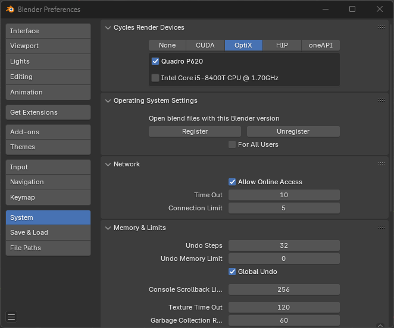
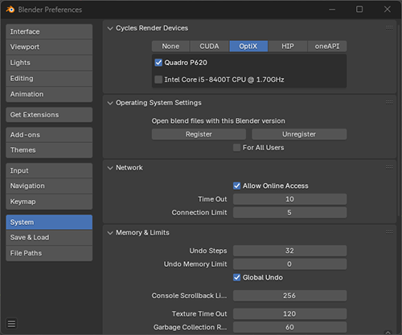
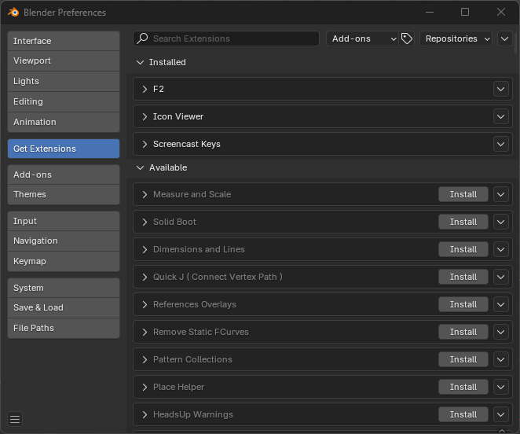
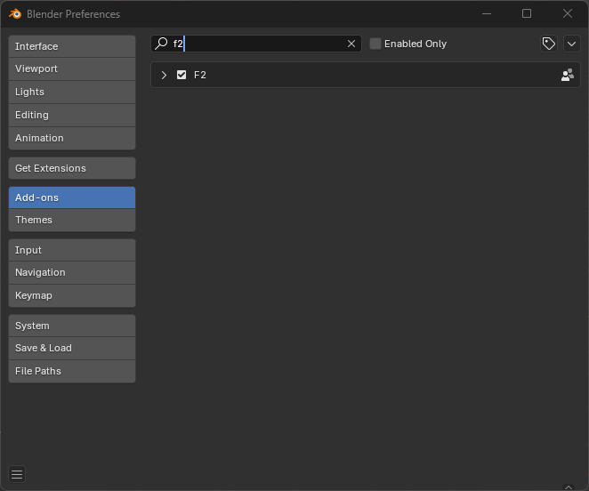

## Addons Blender

Una pregunta que nos planteamos al usar Blender 4.2 es donde demonios se activan los addons, ya que con esta nueva actualización algunas cosas cambiaron.

Para resolverlo dejo una serie de pasos y capturas de pantalla para aclarar el tema.

En Edit >  Preferences > System tildeamos la opción Allow Online Access que esta en Network

Prueba de escalado de imágenes. 

<picture>
  <source media="(min-width:1080px)" srcset="./assets/blenderimg/network500.png">
  <source media="(min-width:500px)" srcset="./assets/blenderimg/network500.png">
  
</picture>

Después a Get Extensions, en este caso lo que nos interesa es tener el addon F2 que es para eficientar el proceso de hacer caras. En Avilalable no aparece los addons que estan disponibles pero que no estan instalados, en la lupa podemos tipea el nombre como F2,.

Nos vamos a pestana  del Add ons, en la lupa tipeamos F2 y lo tildeamos para activarlo

_fsl_

[Regresar](./)
